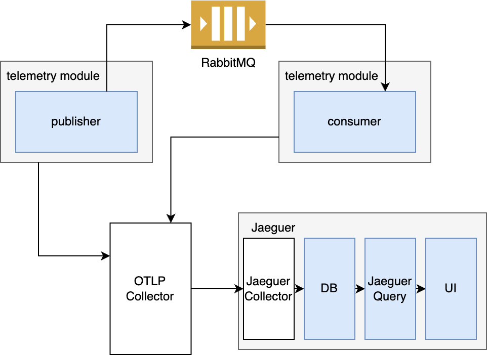
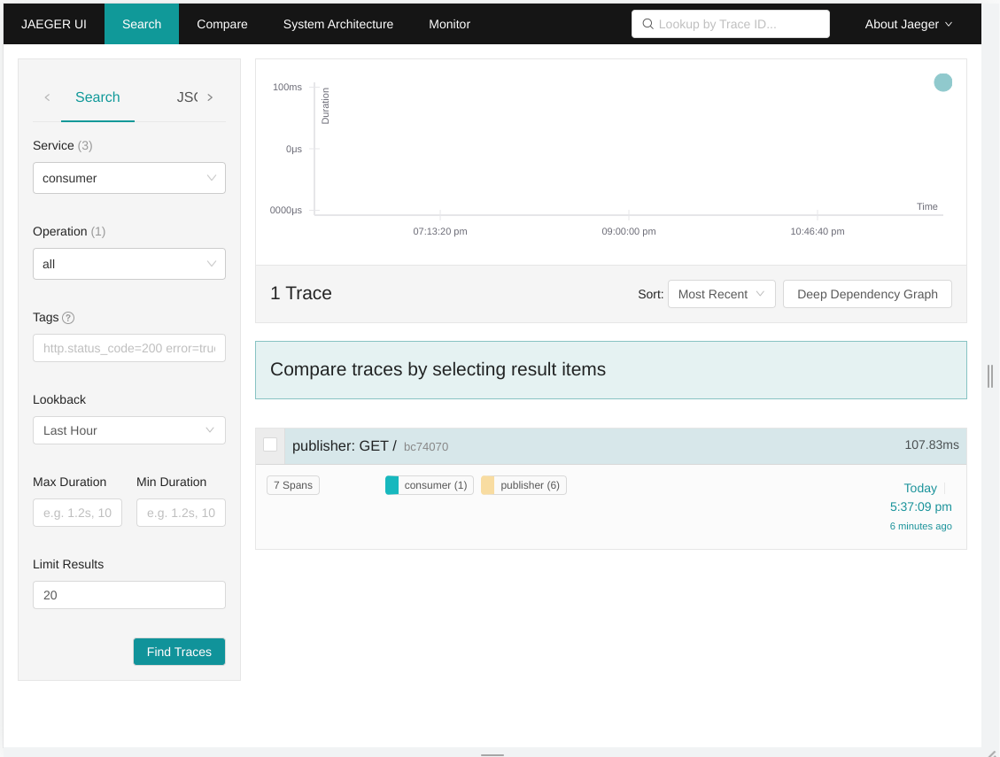
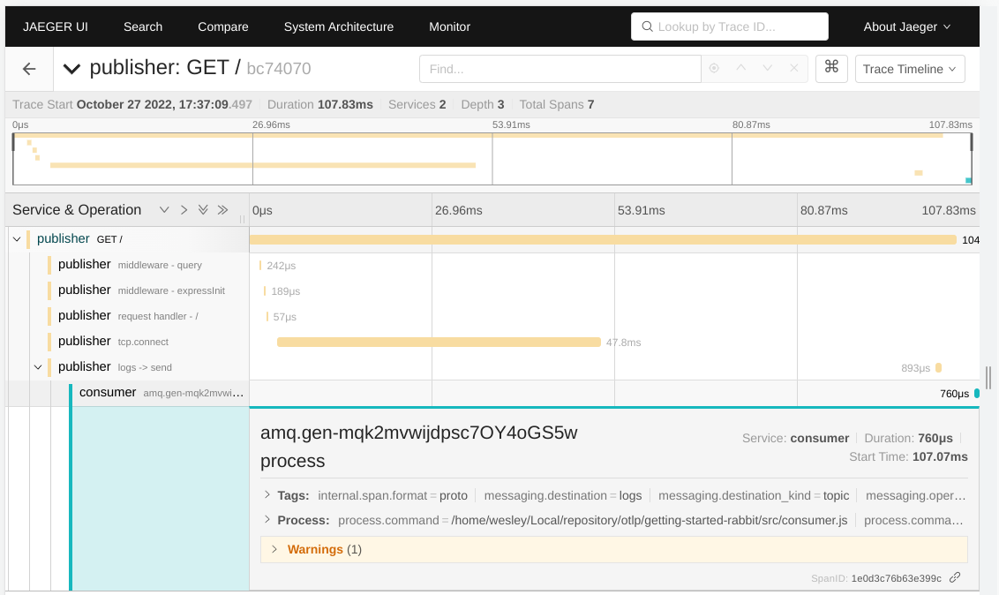

# Node JS Open Telemetry 

This is an implementation of Open Telemetry using Node JS with an environment that uses AMQP and HTTP to communicate and sends Tracing data to the OTLP Collector, which exports the data to Jaeguer.

<p align="center">
  
</p>

In this implementation, we have 2 applications: `publisher` and `consumer`. The publisher exposes an HTTP endpoint on "/" and once it receives a GET request it sends a message to RabbitMQ under the exchange "logs", which is consumed by the `consumer`. 

To enable Telemetry on these services, the module `telemetry.js` must be loaded before starting the application. This module is communicating to the OTLP Collector to send data using GRPC, the data that should be collected is determined by the instrumentations, which is using `@opentelemetry/auto-instrumentations-node` to automatically detect the instrumentations that should be used.

## Requirements 

* Node 16.18
* [Docker](https://www.docker.com/products/docker-desktop/) 
* [Docker Compose](https://docs.docker.com/compose/install/)

## Configuring

The code requires the following environments variables to work correctly:

* **SERVICE_NAME**: the Telemetry will use this name to identify the service;
* **OTEL_EXPORTER_OTLP_ENDPOINT**(optional): sets the endpoint to connect to the OTLP collector. Default: http://localhost:4318 (for gRpc);
* **ENABLE_LOGS**: wheter or not the applications should emit logs to stdout;

NOTE: while using `npm run start:publisher` and `npm run start:consumer` these variables are set by default.

## Running Locally

To run it locally, first of all, you need to start the dependencies decribed on the `docker-compose.yaml file`:

```
cd docker && docker compose up 
```

Once the dependencies are up and runnings, on another terminal, you should start the applications. Open a new terminal and run:

```
npm run start:publisher
```

and on another terminal run:

```
npm run start:consumer
```

Then, once again, open another terminal and execute:
```
curl localhost:3000
```

This request will trigger the `publisher` that will send a message to RabbitMQ. At this point, the all the `publisher`'s generated logs will contain telemetry data such as `trace_id` and `span_id`. Once the consumer consumes this message it will also emit logs with telemetry data where the `trace_id` will be the same emitted by the `publisher`, enabling an association between these logs that where emitted by different applications.

At the same time, the Telemetry module is sending data to the OTLP collector Running on Docker. This collector is configured with the file `docker/collector-config` that is configuring the Collector to send the received data to Jaeguer, which is available on `http://localhost:16686`

<p align="center">
  
</p>

Then you can click on the generated Trace (publisher: GET /) and analyze the entire operation path into your distributed system

<p align="center">
  
</p>